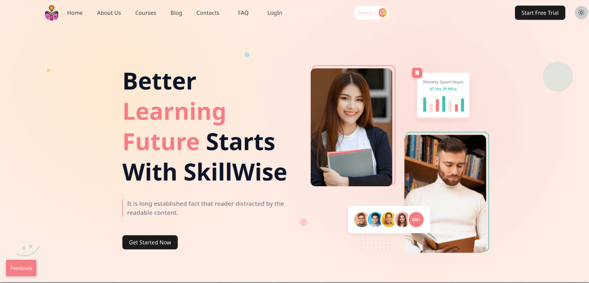
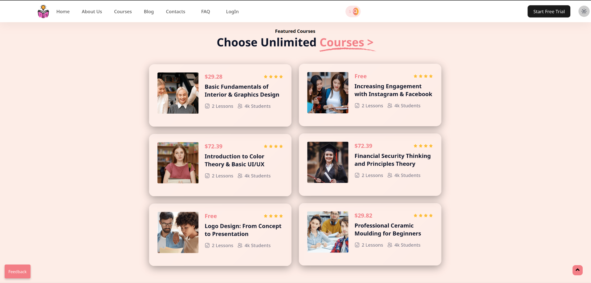

<div align="center">

# `SkillWise`

<br>

<br>

_<i>SkillWise is an innovative online platform designed to help learners of all ages acquire new skills and knowledge. With a wide range of engaging courses and expert instructors, SkillWise provides the tools you need to succeed in today’s competitive world.</i>_

<br>

<table align="center">
    <thead align="center">
        <tr border: 1px;>
            <td><b>🌟 Stars</b></td>
            <td><b>🍴 Forks</b></td>
            <td><b>🐛 Issues</b></td>
            <td><b>🔔 Open PRs</b></td>
            <td><b>🔕 Close PRs</b></td>
        </tr>
     </thead>
    <tbody>
         <tr>
            <td></td>
            <td></td>
            <td></td>
            <td></td>
            <td></td>
        </tr>
    </tbody>
</table>
</div>
<br>

## Features💡
- 📚**Interactive and Engaging Courses:** Immerse yourself in dynamic learning experiences that combine theory with practical application.
- 👩‍🏫**Expert Instructors:** Learn from seasoned professionals who are passionate about their subjects and dedicated to your success.
- 🌐**Supportive Community:** Connect with like-minded learners, share insights, and build valuable relationships.
- 🎯**Personalized Learning Paths:** Tailor your learning journey to your specific goals and interests with our personalized learning paths.
- ⏳**Flexible Learning:** Study at your own pace and on your preferred devices.
- 💼**Real-World Projects:** Apply your knowledge through hands-on projects that simulate real-world scenarios.

## About Us❤️
At **SkillWise** , we’re committed to transforming learning through immersive and tailored experiences. Catering to all ages and skill levels, our platform offers diverse interactive courses. We believe in personalized learning paths that adapt to your needs. With expert instructors, real-world projects, and a supportive community, we empower you to succeed.🥇

Our mission is to bridge the gap between theoretical knowledge and practical application, ensuring that our learners not only acquire new skills but also feel confident in applying them in real-life situations.💡

Welcome to **SkillWise**, an innovative online platform designed to help learners of all ages acquire new skills and knowledge. With a wide range of engaging courses and expert instructors, SkillWise provides the tools you need to succeed in today’s competitive world.

We are more than just an educational platform—we are a community of lifelong learners, dedicated to making education accessible, engaging, and impactful.🌍✨

With our expert instructors, real-world projects, and a supportive learning community, SkillWise empowers individuals to achieve personal and professional success.

## Prerequisites🛠️

Ensure you have the following installed:

- **Git**: Version control system to manage and track changes in your codebase. [Download Git](https://git-scm.com/downloads)
- **Node.js**: JavaScript runtime environment to run the project. [Download Node.js](https://nodejs.org/)
- **npm**: Node package manager to install dependencies. It comes bundled with Node.js.
- **Web Browser**: A modern web browser like Google Chrome or Firefox for testing the application.

## Getting Started🚀

Follow these steps to start your learning journey with SkillWise:

1. **Sign Up**📝: Create your SkillWise account by visiting our [sign-up page](#).
2. **Browse Courses**📚: Discover a variety of courses across different fields. Use the search and filter options to find courses that match your interests.
3. **Enroll**🎓: Join the courses that interest you by clicking the "Enroll" button on the course page.
4. **Learn and Grow**📈: Start learning at your own pace. Track your progress through the course dashboard and complete assignments to reinforce your knowledge.

Enjoy your learning experience with SkillWise!😊

## Contributing🌍

We welcome contributions from the community. To contribute, follow these detailed steps:

1. **Fork the Repository**:

   - Navigate to the repository on GitHub.
   - Click the [Fork](https://github.com/PriyaGhosal/SkillWise/fork) button at the top right of the page to create a copy of the repository under your GitHub account.
   - For more information, see [GitHub's Forking Guide](https://docs.github.com/en/github/getting-started-with-github/fork-a-repo).

2. **Clone the Forked Repository**:

   - Open your terminal or command prompt.
   - Clone your forked repository to your local machine using the command:
     ```bash
     git clone https://github.com/your-username/SkillWise.git
     ```
   - Replace `your-username` with your GitHub username.

3. **Create a New Branch**:

   - Navigate to the repository directory:
     ```bash
     cd SkillWise
     ```
   - Create a new branch for your feature or bug fix:
     ```bash
     git checkout -b feature-branch
     ```
   - Replace `feature-branch` with a descriptive name for your branch.

4. **Make Your Changes**:

   - Implement your changes or additions in the codebase.
   - Ensure your changes follow the project's coding standards and guidelines.

5. **Commit Your Changes**:

   - Stage your changes:
     ```bash
     git add .
     ```
   - Commit your changes with a meaningful commit message:
     ```bash
     git commit -m 'Add some feature'
     ```
   - Replace `'Add some feature'` with a descriptive message about your changes.

6. **Push to the Branch**:

   - Push your changes to your forked repository on GitHub:
     ```bash
     git push origin feature-branch
     ```

7. **Open a Pull Request**:
   - Navigate to the original repository on GitHub.
   - Click the "Compare & pull request" button next to your recently pushed branch.
   - Provide a clear and detailed description of your changes in the pull request.
   - Submit the pull request for review.

8. **Follow the Guidelines**:
    - Ensure that your PR aligns with our contribution standards.    

For more detailed instructions, refer to [GitHub's Guide on Creating a Pull Request](https://docs.github.com/en/github/collaborating-with-issues-and-pull-requests/creating-a-pull-request).

Thank you for your contributions to SkillWise!Every contribution, no matter the size, plays a crucial role in enhancing our educational platform and empowering learners to achieve their goals! 📚✨

## Website Preview🖼
<br>



<br>

# Contributors

<!-- readme: contributors -start -->
<table>
	<tbody>
		<tr>
            <td align="center">
                <a href="https://github.com/PriyaGhosal">
                    
                    <br />
                    <sub><b>Priya Ghosal</b></sub>
                </a>
            </td>
            <td align="center">
                <a href="https://github.com/yashksaini-coder">
                    
                    <br />
                    <sub><b>Yash Kumar Saini</b></sub>
                </a>
            </td>
            <td align="center">
                <a href="https://github.com/yeshwanth-ds">
                    
                    <br />
                    <sub><b>Yeshwanth</b></sub>
                </a>
            </td>
            <td align="center">
                <a href="https://github.com/anuragverma108">
                    
                    <br />
                    <sub><b>Anurag Verma</b></sub>
                </a>
            </td>
            <td align="center">
                <a href="https://github.com/rahul-chakradhari">
                    
                    <br />
                    <sub><b>Rahul Chakradhari</b></sub>
                </a>
            </td>
            <td align="center">
                <a href="https://github.com/RAVICHANDRALS507">
                    
                    <br />
                    <sub><b>RAVICHANDRA L S</b></sub>
                </a>
            </td>
		</tr>
		<tr>
            <td align="center">
                <a href="https://github.com/sainKunal">
                    
                    <br />
                    <sub><b>Kunal Kumar</b></sub>
                </a>
            </td>
            <td align="center">
                <a href="https://github.com/UdaySharmaGitHub">
                    
                    <br />
                    <sub><b>Uday Sharma</b></sub>
                </a>
            </td>
            <td align="center">
                <a href="https://github.com/kavya-r30">
                    
                    <br />
                    <sub><b>kavya-r30</b></sub>
                </a>
            </td>
            <td align="center">
                <a href="https://github.com/Sankar-1110">
                    
                    <br />
                    <sub><b>NAKKA  SAI SANKAR</b></sub>
                </a>
            </td>
            <td align="center">
                <a href="https://github.com/kanduru-abhiram">
                    
                    <br />
                    <sub><b>K Abhiram</b></sub>
                </a>
            </td>
            <td align="center">
                <a href="https://github.com/SunkaraboinaPraveenKumar">
                    
                    <br />
                    <sub><b>SunkaraboinaPraveenKumar</b></sub>
                </a>
            </td>
		</tr>
		<tr>
            <td align="center">
                <a href="https://github.com/satyamkoshta340">
                    
                    <br />
                    <sub><b>Satyam Koshta</b></sub>
                </a>
            </td>
            <td align="center">
                <a href="https://github.com/ankit071105">
                    
                    <br />
                    <sub><b>Ankit Kumar</b></sub>
                </a>
            </td>
            <td align="center">
                <a href="https://github.com/Durgaprasad-Developer">
                    
                    <br />
                    <sub><b>Durgaprasad-Developer</b></sub>
                </a>
            </td>
            <td align="center">
                <a href="https://github.com/1nsh">
                    
                    <br />
                    <sub><b>Vansh Chitransh</b></sub>
                </a>
            </td>
            <td align="center">
                <a href="https://github.com/shivamv02">
                    
                    <br />
                    <sub><b>shivamv02</b></sub>
                </a>
            </td>
            <td align="center">
                <a href="https://github.com/codeforlifeee">
                    
                    <br />
                    <sub><b>Tejas Surya</b></sub>
                </a>
            </td>
		</tr>
		<tr>
            <td align="center">
                <a href="https://github.com/Sayantan1024">
                    
                    <br />
                    <sub><b>Sayantan Saha</b></sub>
                </a>
            </td>
            <td align="center">
                <a href="https://github.com/shobhit15082003">
                    
                    <br />
                    <sub><b>shobhit15082003</b></sub>
                </a>
            </td>
            <td align="center">
                <a href="https://github.com/shivamnayak201019">
                    
                    <br />
                    <sub><b>shivamnayak201019</b></sub>
                </a>
            </td>
            <td align="center">
                <a href="https://github.com/SiddhanthKapoor">
                    
                    <br />
                    <sub><b>SiddhanthKapoor</b></sub>
                </a>
            </td>
            <td align="center">
                <a href="https://github.com/Shobhit1729Aryan">
                    
                    <br />
                    <sub><b>Shobhit Aryan</b></sub>
                </a>
            </td>
            <td align="center">
                <a href="https://github.com/PrajaktaPatil05">
                    
                    <br />
                    <sub><b>Prajakta Patil</b></sub>
                </a>
            </td>
		</tr>
		<tr>
            <td align="center">
                <a href="https://github.com/Nikhileshmauje">
                    
                    <br />
                    <sub><b>NikhileshM24</b></sub>
                </a>
            </td>
            <td align="center">
                <a href="https://github.com/Gurpreet0022">
                    
                    <br />
                    <sub><b>Gurpreet Kaur</b></sub>
                </a>
            </td>
            <td align="center">
                <a href="https://github.com/Adil-Khan-N">
                    
                    <br />
                    <sub><b>Adil-Khan-N</b></sub>
                </a>
            </td>
            <td align="center">
                <a href="https://github.com/SreyaSudheeran">
                    
                    <br />
                    <sub><b>Sreya Sudheeran</b></sub>
                </a>
            </td>
            <td align="center">
                <a href="https://github.com/rudrakadel">
                    
                    <br />
                    <sub><b>Rudra Kadel</b></sub>
                </a>
            </td>
            <td align="center">
                <a href="https://github.com/karraharichandana">
                    
                    <br />
                    <sub><b>karraharichandana</b></sub>
                </a>
            </td>
		</tr>
		<tr>
            <td align="center">
                <a href="https://github.com/megh-bari">
                    
                    <br />
                    <sub><b>Megh Bari</b></sub>
                </a>
            </td>
            <td align="center">
                <a href="https://github.com/akash70629">
                    
                    <br />
                    <sub><b>Akash Das</b></sub>
                </a>
            </td>
            <td align="center">
                <a href="https://github.com/abhipariharr">
                    
                    <br />
                    <sub><b>Abhishek parihar</b></sub>
                </a>
            </td>
            <td align="center">
                <a href="https://github.com/BrahmajitMohapatra">
                    
                    <br />
                    <sub><b>Brahmajit Mohapatra</b></sub>
                </a>
            </td>
            <td align="center">
                <a href="https://github.com/Mritunjaii">
                    
                    <br />
                    <sub><b>Mritunjai</b></sub>
                </a>
            </td>
            <td align="center">
                <a href="https://github.com/invincyx">
                    
                    <br />
                    <sub><b>Tatenda </b></sub>
                </a>
            </td>
		</tr>
		<tr>
            <td align="center">
                <a href="https://github.com/TeamSelenium">
                    
                    <br />
                    <sub><b>TeamSelenium</b></sub>
                </a>
            </td>
            <td align="center">
                <a href="https://github.com/stutxi">
                    
                    <br />
                    <sub><b>Stuti </b></sub>
                </a>
            </td>
            <td align="center">
                <a href="https://github.com/realvishalrana">
                    
                    <br />
                    <sub><b>Vishal Rana</b></sub>
                </a>
            </td>
            <td align="center">
                <a href="https://github.com/yalsik86">
                    
                    <br />
                    <sub><b>yalsik86</b></sub>
                </a>
            </td>
            <td align="center">
                <a href="https://github.com/Yaser-2004">
                    
                    <br />
                    <sub><b>Yaser-2004</b></sub>
                </a>
            </td>
            <td align="center">
                <a href="https://github.com/anshumangahlot">
                    
                    <br />
                    <sub><b>anshumangahlot</b></sub>
                </a>
            </td>
		</tr>
		<tr>
            <td align="center">
                <a href="https://github.com/doctor-rutvik14">
                    
                    <br />
                    <sub><b>Rutvik Doctor</b></sub>
                </a>
            </td>
            <td align="center">
                <a href="https://github.com/jaideepjaison">
                    
                    <br />
                    <sub><b>Jaison Lobo</b></sub>
                </a>
            </td>
            <td align="center">
                <a href="https://github.com/umakant3525">
                    
                    <br />
                    <sub><b>Umakant Shinde</b></sub>
                </a>
            </td>
            <td align="center">
                <a href="https://github.com/lord-cyclone100">
                    
                    <br />
                    <sub><b>Sangneel Deb</b></sub>
                </a>
            </td>
            <td align="center">
                <a href="https://github.com/tusharmishra069">
                    
                    <br />
                    <sub><b>Tushar Mishra</b></sub>
                </a>
            </td>
            <td align="center">
                <a href="https://github.com/mitgajera">
                    
                    <br />
                    <sub><b>Mit Gajera</b></sub>
                </a>
            </td>
		</tr>
		<tr>
            <td align="center">
                <a href="https://github.com/ndrisanseep3">
                    
                    <br />
                    <sub><b>ndrisanseep3</b></sub>
                </a>
            </td>
            <td align="center">
                <a href="https://github.com/nitesh2920">
                    
                    <br />
                    <sub><b>Nitesh Tiwari</b></sub>
                </a>
            </td>
            <td align="center">
                <a href="https://github.com/purnima2904">
                    
                    <br />
                    <sub><b>Purnima Gupta</b></sub>
                </a>
            </td>
            <td align="center">
                <a href="https://github.com/rahulbamnuya">
                    
                    <br />
                    <sub><b>rahulbamnuya</b></sub>
                </a>
            </td>
            <td align="center">
                <a href="https://github.com/sambhavbohra">
                    
                    <br />
                    <sub><b>sambhavbohra</b></sub>
                </a>
            </td>
            <td align="center">
                <a href="https://github.com/srinivasthedeveloper">
                    
                    <br />
                    <sub><b>SRINIVAStheDEVELOPER</b></sub>
                </a>
            </td>
		</tr>
		<tr>
            <td align="center">
                <a href="https://github.com/swamimalode07">
                    
                    <br />
                    <sub><b>Swami Malode</b></sub>
                </a>
            </td>
            <td align="center">
                <a href="https://github.com/tejasbenibagde">
                    
                    <br />
                    <sub><b>Tejas Benibagde</b></sub>
                </a>
            </td>
            <td align="center">
                <a href="https://github.com/Aakansha-Chavan">
                    
                    <br />
                    <sub><b>Aakansha-Chavan</b></sub>
                </a>
            </td>
            <td align="center">
                <a href="https://github.com/Anan014d">
                    
                    <br />
                    <sub><b>Anan014d</b></sub>
                </a>
            </td>
            <td align="center">
                <a href="https://github.com/SinghaAnirban005">
                    
                    <br />
                    <sub><b>Anirban Singha</b></sub>
                </a>
            </td>
            <td align="center">
                <a href="https://github.com/AnshDwivedi03">
                    
                    <br />
                    <sub><b>Ansh Dwivedi</b></sub>
                </a>
            </td>
		</tr>
		<tr>
            <td align="center">
                <a href="https://github.com/Deepak0yadav">
                    
                    <br />
                    <sub><b>Deepak yadav</b></sub>
                </a>
            </td>
            <td align="center">
                <a href="https://github.com/iAmDiksha">
                    
                    <br />
                    <sub><b>Diksha Jain</b></sub>
                </a>
            </td>
            <td align="center">
                <a href="https://github.com/FSBM">
                    
                    <br />
                    <sub><b>SHyAm</b></sub>
                </a>
            </td>
            <td align="center">
                <a href="https://github.com/Gauravtb2253">
                    
                    <br />
                    <sub><b>Gaurav Bomble</b></sub>
                </a>
            </td>
            <td align="center">
                <a href="https://github.com/Irtesaam">
                    
                    <br />
                    <sub><b>Irtesaam Atfi</b></sub>
                </a>
            </td>
            <td align="center">
                <a href="https://github.com/KanwalpreetSingh1823">
                    
                    <br />
                    <sub><b>Kanwalpreet Singh</b></sub>
                </a>
            </td>
		</tr>
		<tr>
            <td align="center">
                <a href="https://github.com/github4maninder">
                    
                    <br />
                    <sub><b>Maninder Sidhu</b></sub>
                </a>
            </td>
            <td align="center">
                <a href="https://github.com/sadique-2004">
                    
                    <br />
                    <sub><b>Md Sadique</b></sub>
                </a>
            </td>
            <td align="center">
                <a href="https://github.com/MohammedDayan03">
                    
                    <br />
                    <sub><b>MohammedDayan03</b></sub>
                </a>
            </td>
            <td align="center">
                <a href="https://github.com/PragyaTripathi990">
                    
                    <br />
                    <sub><b>PragyaTripathi990</b></sub>
                </a>
            </td>
            <td align="center">
                <a href="https://github.com/rajputpritesh1">
                    
                    <br />
                    <sub><b>Pritesh Rajput</b></sub>
                </a>
            </td>
            <td align="center">
                <a href="https://github.com/priyanshufox">
                    
                    <br />
                    <sub><b>Priyanshu Rathore</b></sub>
                </a>
            </td>
		</tr>
		<tr>
            <td align="center">
                <a href="https://github.com/RAGHAVS1304">
                    
                    <br />
                    <sub><b>Raghav</b></sub>
                </a>
            </td>
            <td align="center">
                <a href="https://github.com/Rishika367">
                    
                    <br />
                    <sub><b>Rishika Ghosh</b></sub>
                </a>
            </td>
            <td align="center">
                <a href="https://github.com/Shivaraj2003">
                    
                    <br />
                    <sub><b>Shivaraj Shetty</b></sub>
                </a>
            </td>
            <td align="center">
                <a href="https://github.com/soumya1810">
                    
                    <br />
                    <sub><b>Soumya Singh</b></sub>
                </a>
            </td>
		</tr>
	<tbody>
</table>
<!-- readme: contributors -end -->

## Get in Touch with Us 💬 

Do you have questions, ideas, or simply want to get involved in our mission? We'd love to hear from you!

🌐 **Visit our website:** [SkillWise](https://skillwise-delta.vercel.app/#)  
📧 **Contact us:** Reach out directly through our website for more information.  
📱 **Follow us on social media** for the latest updates, campaigns, and conservation efforts.

*<i>Join a community of lifelong learners dedicated to accessible and engaging education. With flexible options and hands-on projects, SkillWise equips you to thrive in today’s dynamic world! 🌍✨🌱🌍</i>*
